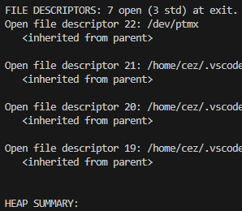
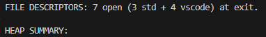

# ZshAliases

## Main Functions

### $ **val [options] ./program**
- Runs valgrind with predefined options (track-fds, leak-check, trace-children)
- Filters out and counts annoying file descriptors shown by VS Code

  
  ➤
  

### $ **pu ["message"]**
- `git add . && git commit -m <message> && git push`
- Default commit message if no message given: "Squid Update 🦑"

## Useful Aliases

### $ **ez** : Opens `.zshrc` in VS Code  
### $ **sz** : Reloads `.zshrc` (source)
